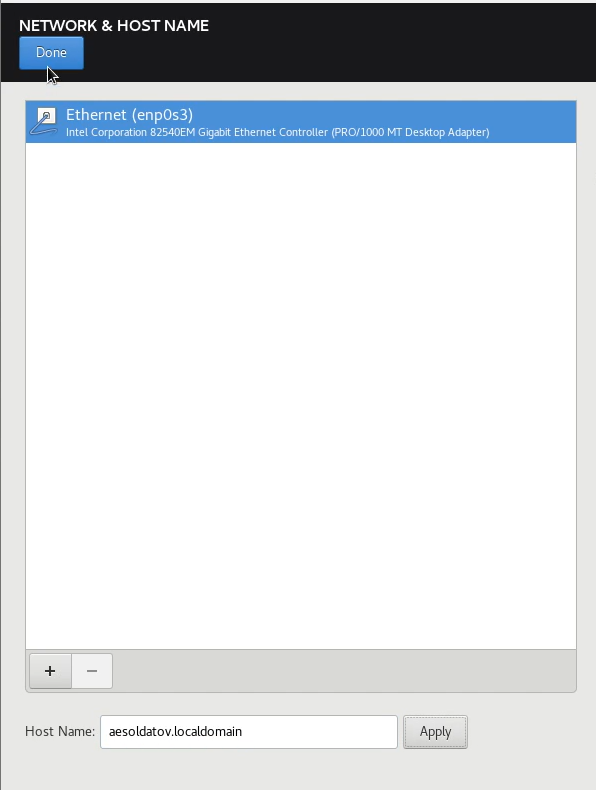

---
## Front matter
lang: ru-RU
title: Презентация по лабораторной работе №1
subtitle: Информационная безопасность      
author:
  - Солдатов А. Е
institute:
  - Российский университет дружбы народов, Москва, Россия
  - НКАбд-04-23
date: 22 февраля 2025

## i18n babel
babel-lang: russian
babel-otherlangs: english

## Formatting pdf
toc: false
toc-title: Содержание
slide_level: 2
aspectratio: 169
section-titles: true
theme: metropolis
header-includes:
 - \metroset{progressbar=frametitle,sectionpage=progressbar,numbering=fraction}
 - '\makeatletter'
 - '\beamer@ignorenonframefalse'
 - '\makeatother'

## Fonts
mainfont: PT Serif
romanfont: PT Serif
sansfont: PT Sans
monofont: PT Mono
mainfontoptions: Ligatures=TeX
romanfontoptions: Ligatures=TeX
sansfontoptions: Ligatures=TeX,Scale=MatchLowercase
monofontoptions: Scale=MatchLowercase,Scale=0.9
---

## Докладчик

:::::::::::::: {.columns align=center}
::: {.column width="70%"}

  * Солдатов Алексей Евгеньевич
  * Студент
  * НКАбд-04-23
  * Российский университет дружбы народов
  * [1132236009@pfur.ru](mailto:1132236009@rudn.ru)

:::
::: {.column width="30%"}

:::
::::::::::::::

## Цели и задачи

Целью работы является умение установливать операционную систему на виртуальную машину а также минимально настраивать работу сервисов.

# Выполнение лабораторной работы

## 

Устанавливаю систему Rocky и подбираю необходимые для работы настройки

## 

Запустил виртуальную машину и указал английский язык.

{#fig:006 width=70%}

##

Настроил переключение раскладки (рис. [-@fig:007]).

{#fig:007 width=70%}

##

Указал часовой пояс (рис. [-@fig:008]).

{#fig:008 width=70%}

##

Выбрал базовое и дополнительное окружение (рис. [-@fig:009]).

{#fig:009 width=70%}

##

Отключил KDUMP (рис. [-@fig:0010]).

{#fig:010 width=70%}

##

Место установки оставил без изменения (рис. [-@fig:011]).

{#fig:011 width=70%}

##

В сетевом соединении указал новое имя узла (рис. [-@fig:012]).

{#fig:012 width=70%}

##

Установил пароль для root (рис. [-@fig:013]).

{#fig:013 width=70%}

##

Задал пользователя и пароль (рис. [-@fig:014]).

{#fig:014 width=70%}

##

Завершил установку (рис. [-@fig:015]).

{#fig:015 width=70%} 

## Выводы

Я приобрел навыки установки операционной системы.
