---
## Front matter
lang: ru-RU
title: Презентация по лабораторной работе №2
subtitle: Информационная безопасность      
author:
  - Солдатов А. Е
institute:
  - Российский университет дружбы народов, Москва, Россия
  - НКАбд-04-23
date: 7 марта 2025

## i18n babel
babel-lang: russian
babel-otherlangs: english

## Formatting pdf
toc: false
toc-title: Содержание
slide_level: 2
aspectratio: 169
section-titles: true
theme: metropolis
header-includes:
 - \metroset{progressbar=frametitle,sectionpage=progressbar,numbering=fraction}
---

# Информация

## Докладчик

:::::::::::::: {.columns align=center}
::: {.column width="70%"}

  * Солдатов Алексей Евгеньевич
  * Студент
  * НКАбд-04-23
  * Российский университет дружбы народов
  * [1132236009@pfur.ru](mailto:1132236009@rudn.ru)

:::
::: {.column width="30%"}

:::
::::::::::::::

## Цели и задачи

Получение практических навыков работы в консоли с атрибутами файлов, закрепление теоретических основ дискреционного разграничения доступа в современных системах с открытым кодом на базе ОС Linux.

## Выполнение лабораторной работы

## 

В установленной при выполнении предыдущей лабораторной работы операционной системе создал учётную запись пользователя "guest" (используя учётную запись администратора) и задал для нее пароль.

## 

Вошел в систему от имени пользователя "guest".

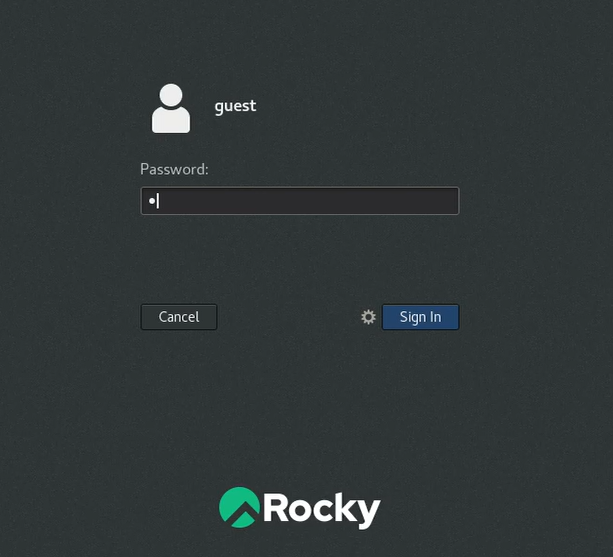

##

Определил директорию, в которй нахожусь, сравнил ее с приглашением командной строки и определил, является ли она моей домашней директорией.

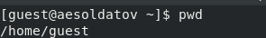

##

Уточнил имя моего пользователя с помощью команды "whoami".

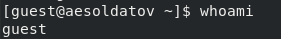

##

Уточнил имя пользователя, его группу, а также группы, куда входит пользователь, командой "id" и сравнл вывод с командой "groups".

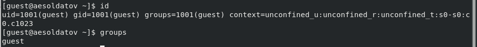

##

Просмотрел файл "/etc/passwd" командой "cat /etc/passwd", найшел в нём свою учётную запись и определил "uid" и "gid" пользователя. Потом сравнил найденные значения с полученными в предыдущих пунктах.

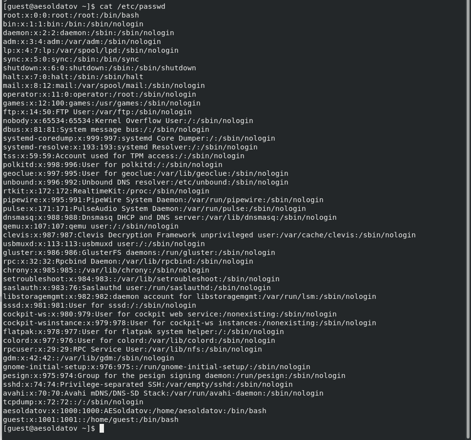

##

Определил существующие в системе директории.

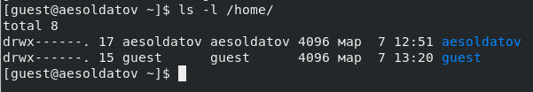

##

Проверил, какие расширенные атрибуты установлены на поддиректориях, находящихся в директории "/home".
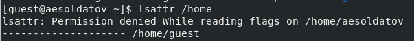

##

Создал в домашней директории поддиректорию "dir1" командой "mkdir dir1" и определил командами "ls -l" и "lsattr", какие права доступа и расширенные атрибуты были выставлены на директорию "dir1".

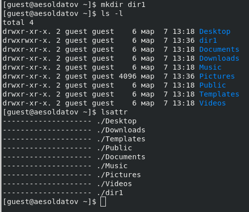

##

Снял с директории "dir1" все атрибуты командой "chmod 000 dir1" и проверил с её помощью правильность выполнения команды "ls -l".

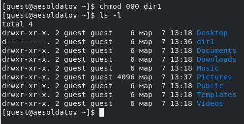

##

Попытался создать в директории "dir1" файл "file1" командой 'echo "test" > /home/guest/dir1/file1' и проверил командой "ls -l /home/guest/dir1" получилось ли создать файл.

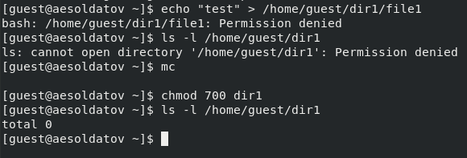

##

Заполнил таблицу «Установленные права и разрешённые действия» выполняя разные действия с разными разрешениями системы.

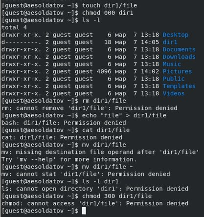

## Выводы

Полученил практические навыки работы в консоли с атрибутами файлов и акрепил теоретические основы дискреционного разграничения доступа в современных системах с открытым кодом на базе ОС Linux.
