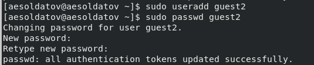
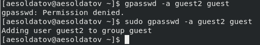
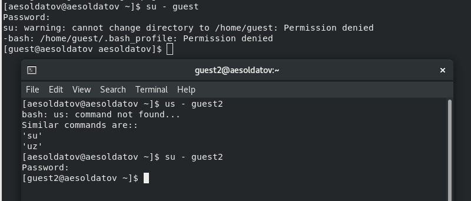
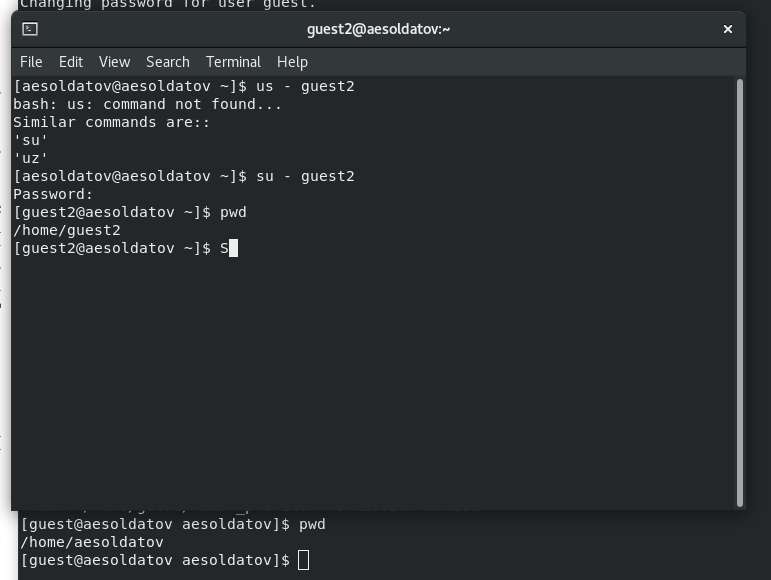
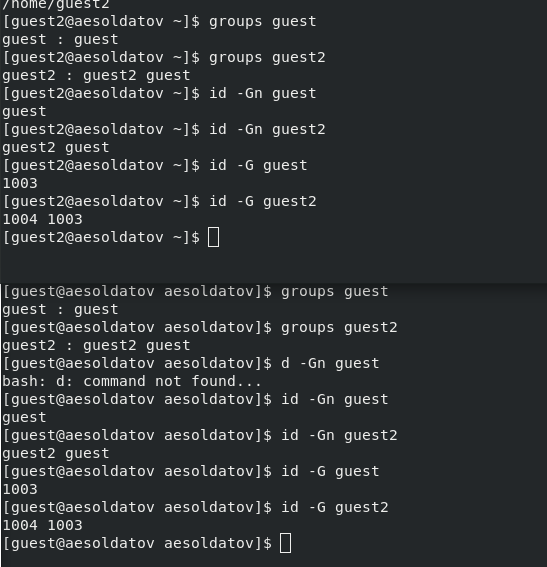
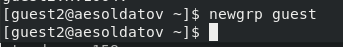

---
## Front matter
lang: ru-RU
title: Презентация по лабораторной работе №3
subtitle: Информационная безопасность      
author:
  - Солдатов А. Е
institute:
  - Российский университет дружбы народов, Москва, Россия
  - НКАбд-04-23
date: 21 марта 2025

## i18n babel
babel-lang: russian
babel-otherlangs: english

## Formatting pdf
toc: false
toc-title: Содержание
slide_level: 2
aspectratio: 169
section-titles: true
theme: metropolis
header-includes:
 - \metroset{progressbar=frametitle,sectionpage=progressbar,numbering=fraction}
 - '\makeatletter'
 - '\beamer@ignorenonframefalse'
 - '\makeatother'

## Fonts
mainfont: PT Serif
romanfont: PT Serif
sansfont: PT Sans
monofont: PT Mono
mainfontoptions: Ligatures=TeX
romanfontoptions: Ligatures=TeX
sansfontoptions: Ligatures=TeX,Scale=MatchLowercase
monofontoptions: Scale=MatchLowercase,Scale=0.9
---

## Докладчик

:::::::::::::: {.columns align=center}
::: {.column width="70%"}

  * Солдатов Алексей Евгеньевич
  * Студент
  * НКАбд-04-23
  * Российский университет дружбы народов
  * [1132236009@pfur.ru](mailto:1132236009@rudn.ru)

:::
::: {.column width="30%"}

:::
::::::::::::::

## Цели и задачи

Получение практических навыков работы в консоли с атрибутами файлов для групп пользователей.

## Выполнение лабораторной работы

## 

В установленной операционной системе создал учётную запись пользователя guest и guest2 и задал для них пароли (для этого использую учётную запись администратора)

## 

Используя команду "gpasswd -a guest2 guest" добавил пользователя guest2 в группу guest

## 

Перезагружаю систему и захожу как новый пользователь guest 

## 

Осуществил вход в систему от двух пользователей на двух разных консолях: guest на первой консоли и guest2 на второй консоли 

## 

Для обоих пользователей командой "pwd" определил директорию, в которой я нахожусь. Сравнил её с приглашениями командной строки

## 

Уточнил имя своего пользователя, его группу, кто входит в неё и к каким группам принадлежит он сам. Определил командами "groups guest" и "groups guest2", в какие группы входят пользователи guest и guest2. Сравнил вывод команды "groups" с выводом команд "id -Gn" и "id -G"

## 

От имени пользователя guest2 выполнил регистрацию пользователя guest2 в группе guest командой "newgrp guest"

## Выводы

Цель работы была достигнута и навыки были получены.
