---
## Front matter
lang: ru-RU
title: Презентация по индивидуальному проекту
subtitle: Информационная безопасность      
author:
  - Солдатов А. Е
institute:
  - Российский университет дружбы народов, Москва, Россия
  - НКАбд-04-23
date: 8 марта 2025

## i18n babel
babel-lang: russian
babel-otherlangs: english

## Formatting pdf
toc: false
toc-title: Содержание
slide_level: 2
aspectratio: 169
section-titles: true
theme: metropolis
header-includes:
 - \metroset{progressbar=frametitle,sectionpage=progressbar,numbering=fraction}
---

# Информация

## Докладчик

:::::::::::::: {.columns align=center}
::: {.column width="70%"}

  * Солдатов Алексей Евгеньевич
  * Студент
  * НКАбд-04-23
  * Российский университет дружбы народов
  * [1132236009@pfur.ru](mailto:1132236009@rudn.ru)

:::
::: {.column width="30%"}

:::
::::::::::::::

## Цели и задачи

Установка ОС Kali Linux на виртуальную машину

## Выполнение лабораторной работы

## 

Задал имя машине и выбрал образ системы (рис. [-@fig:001]).

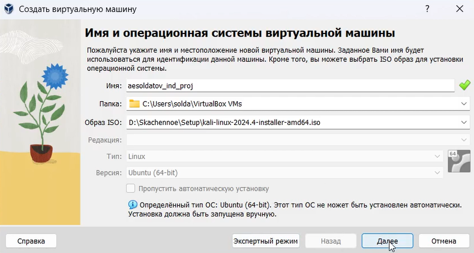{#fig:001 width=70%}

##

Указал количество основной памяти и количество процессоров (рис. [-@fig:002]).

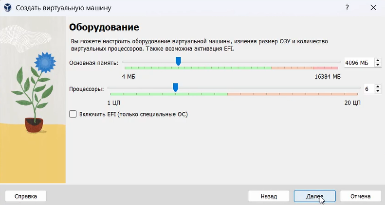{#fig:002 width=70%}

##

Настроил размер жесткого диска (рис. [-@fig:003]).

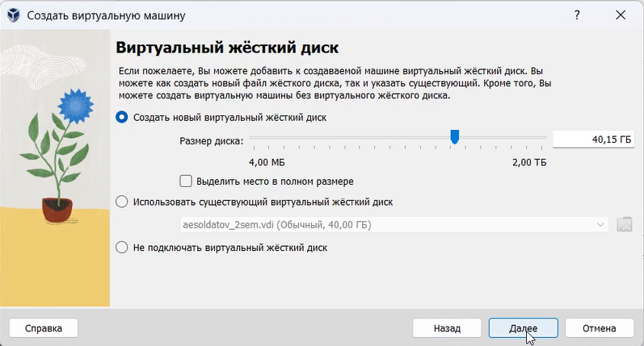{#fig:003 width=70%}

##

Получил итоговую конфигурацию (рис. [-@fig:004]).

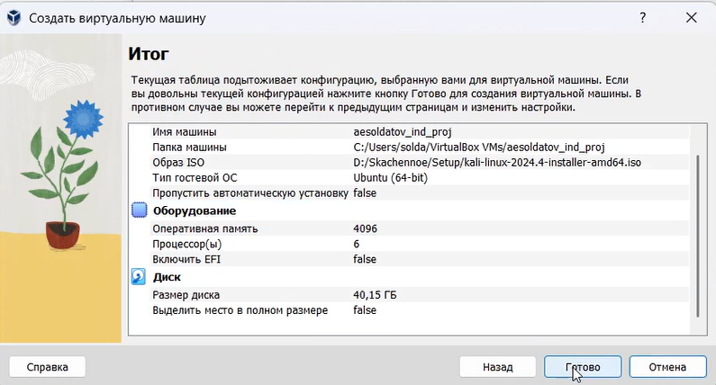{#fig:004 width=70%}

##

Начал установку ОС с выбора языка (рис. [-@fig:005]).

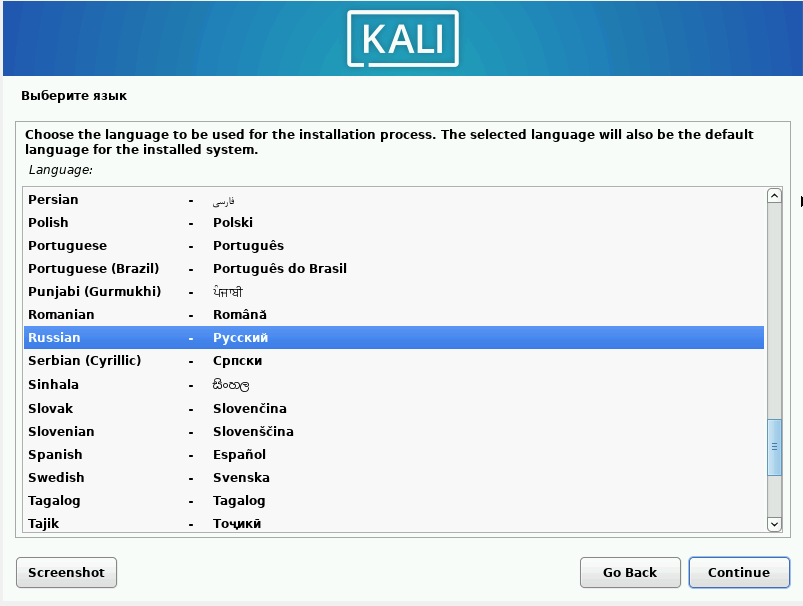{#fig:005 width=70%}

##

Выбрал язык раскладки (рис. [-@fig:006]).

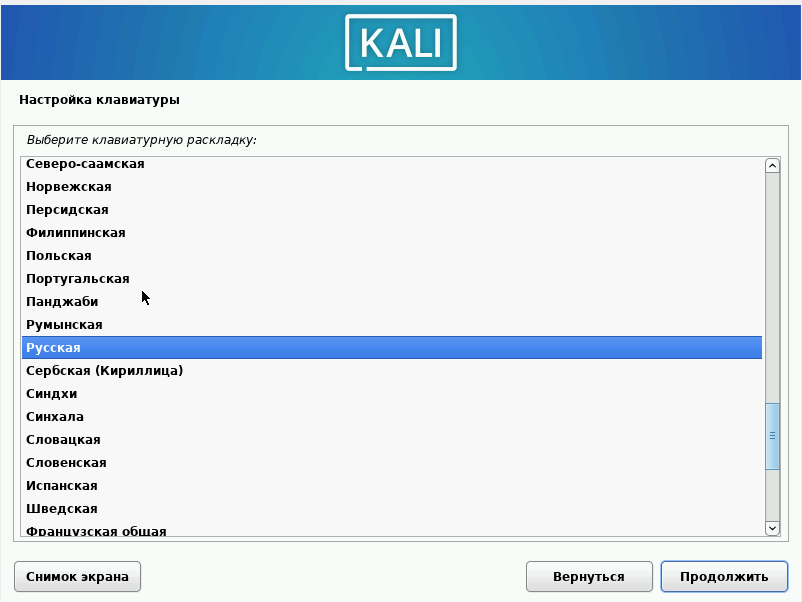{#fig:006 width=70%}

##

Указал имя компьютера (рис. [-@fig:007]).

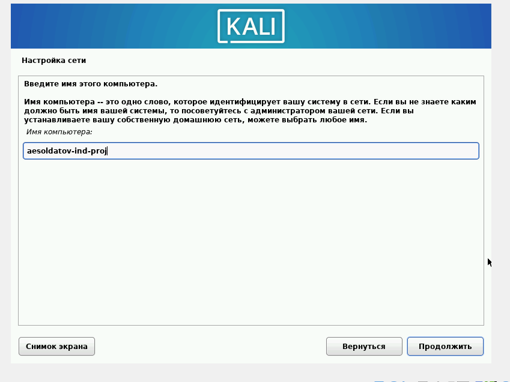{#fig:007 width=70%}

##

Указал имя домена (рис. [-@fig:008]).

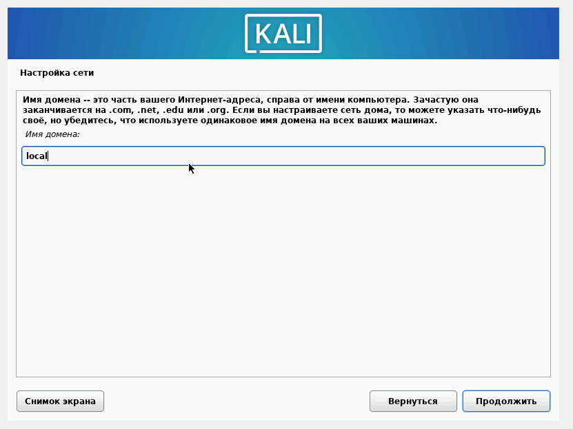{#fig:008 width=70%}

##

Указал имя учетной записи (рис. [-@fig:009]).

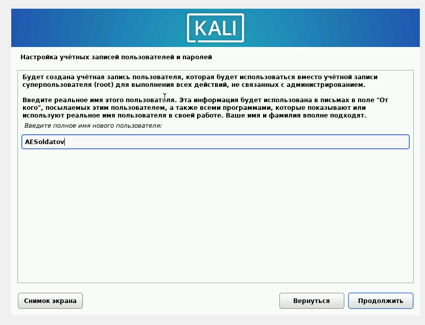{#fig:009 width=70%}

##

Указал имя пользователя (рис. [-@fig:010]).

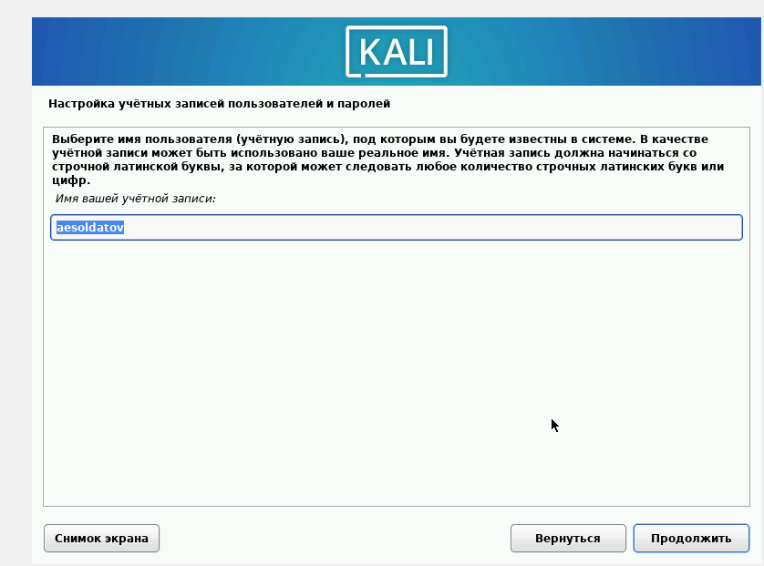{#fig:010 width=70%}

##

Создал парль (рис. [-@fig:011]).

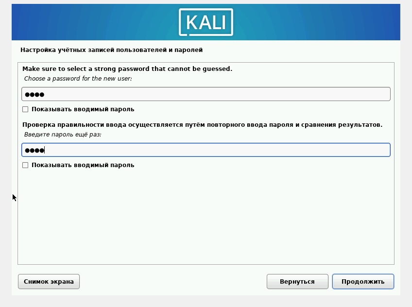{#fig:011 width=70%}

##

Выбрал часовой пояс (рис. [-@fig:012]).

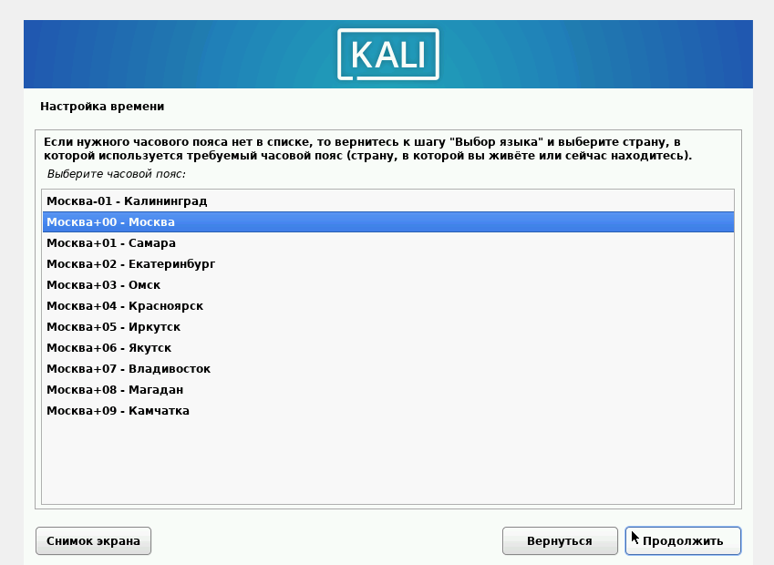{#fig:012 width=70%}

##

Выбрал автоматеческую разметку дисков (рис. [-@fig:013]).

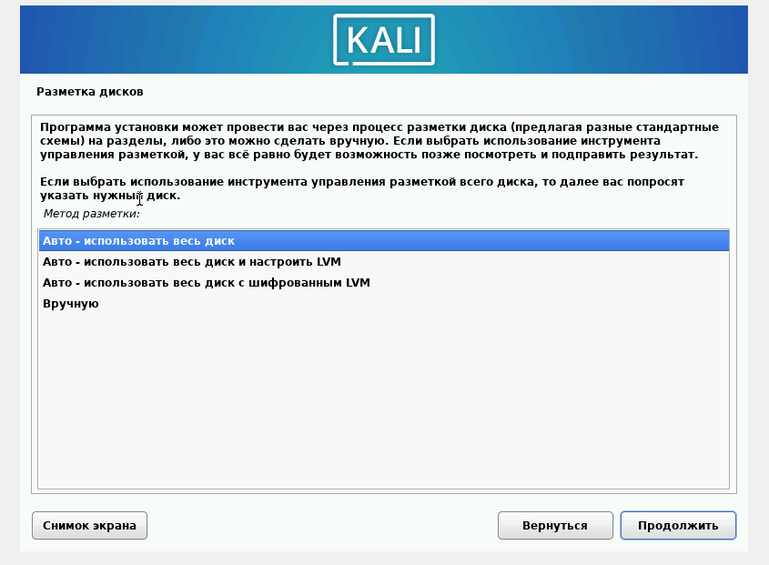{#fig:013 width=70%}

##

Выбрал конкретный диск (рис. [-@fig:014]).

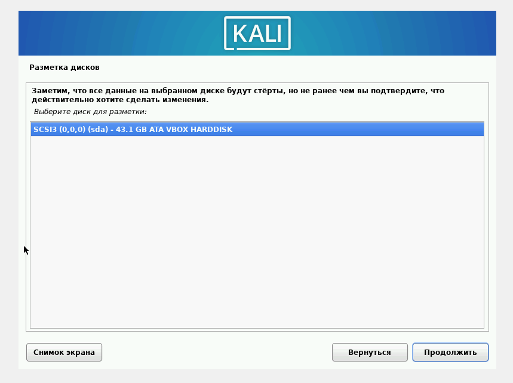{#fig:014 width=70%}

##

Выбрал конкретную схему разметки (рис. [-@fig:015]).

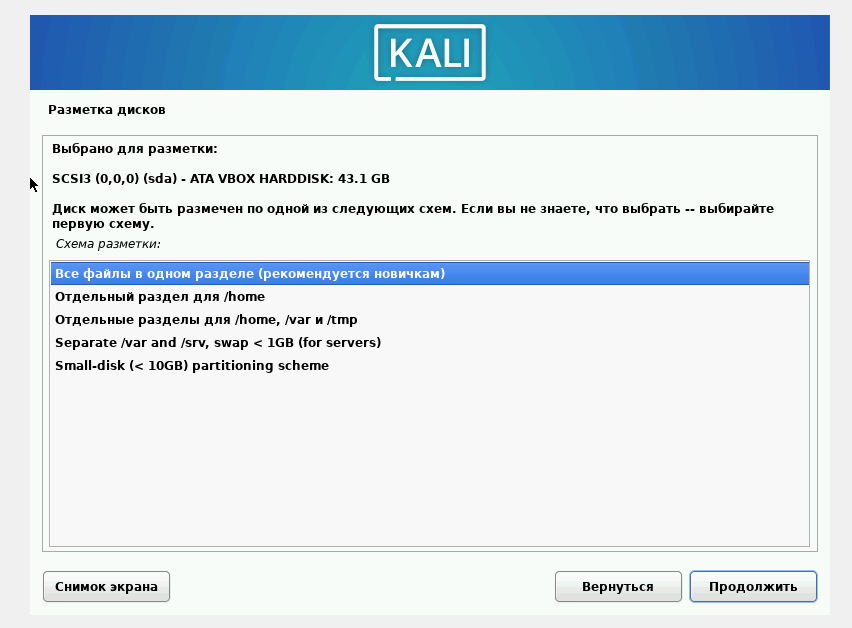{#fig:015 width=70%}

##
'
Выбрал программное обеспечение (рис. [-@fig:016]).

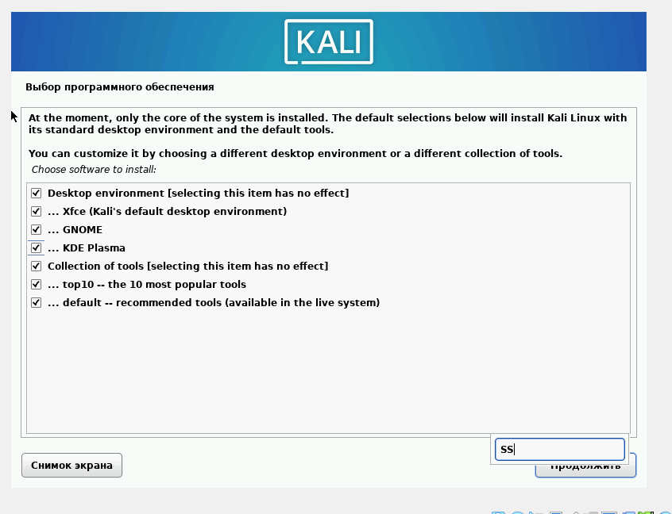{#fig:016 width=70%}

##

Настроил менеджер дисплеев (рис. [-@fig:017]).

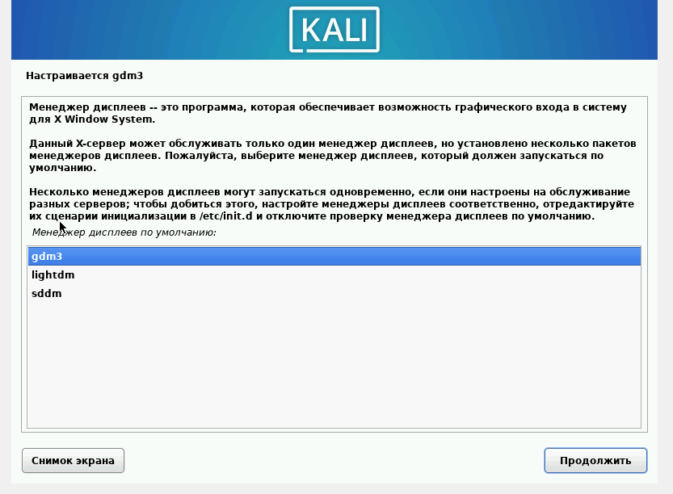{#fig:017 width=70%}

##

Завершил установку ОС (рис. [-@fig:017]).

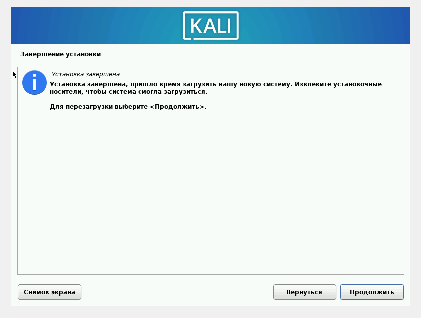{#fig:017 width=70%}

## Выводы

Установил Kali Linux на виртуальную машину
